# 瞬刻 TransAI — 音视频智能转录与 AI 总结平台

> 将音视频"瞬间"转化为可发布的创作素材 —— 让创作者跳过整理，直接开始创作。

[](https://reactjs.org/)
[](https://www.typescriptlang.org/)
[](https://vitejs.dev/)
[](https://nodejs.org/)
[](https://expressjs.com/)
[](https://www.xfyun.cn/)

---

## 目录

- [项目预览](#项目预览)
- [功能特点](#功能特点)
- [技术栈](#技术栈)
- [注意事项](#注意事项)
- [安装与运行](#安装与运行)
- [项目目录结构](#项目目录结构)
- [API 接口](#api-接口)
- [贡献指南](#贡献指南)
- [许可证](#许可证)
- [作者](#作者)

---

## 项目预览

> 以下为各功能模块界面预览，部署后可替换为真实截图。

#### 音视频录制与上传

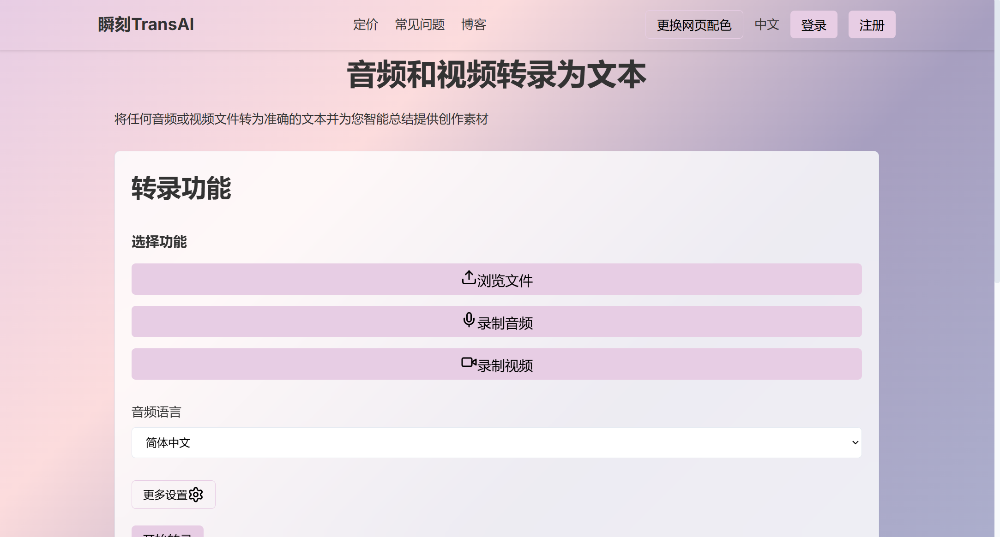

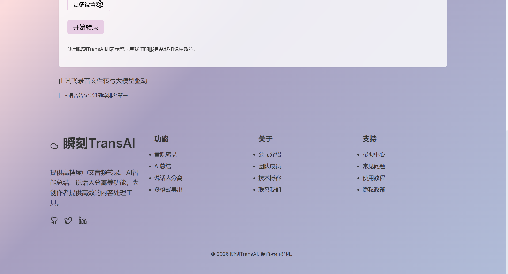

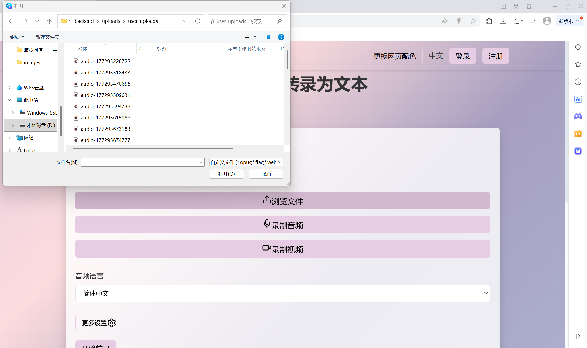

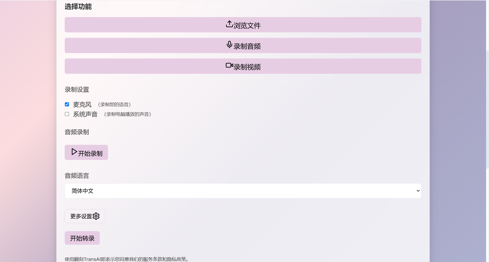

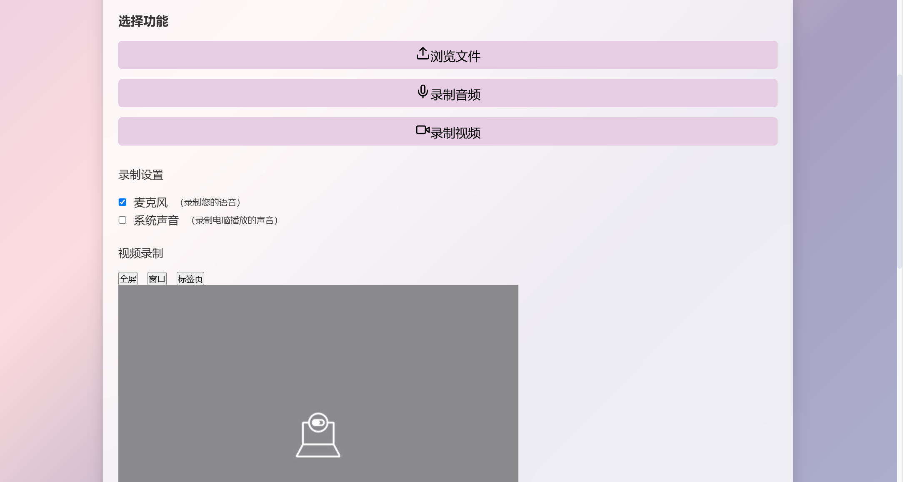

#### 转录结果与 AI 总结

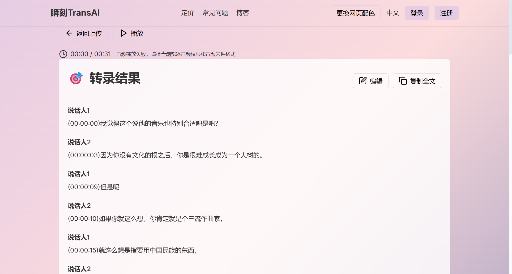

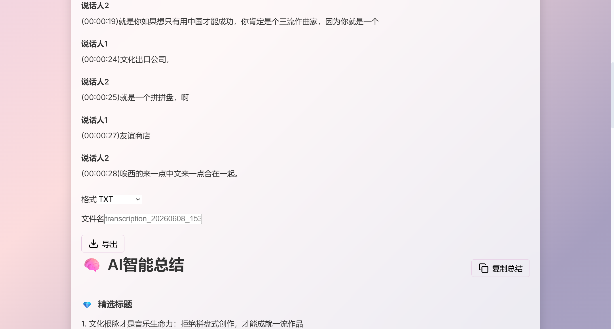

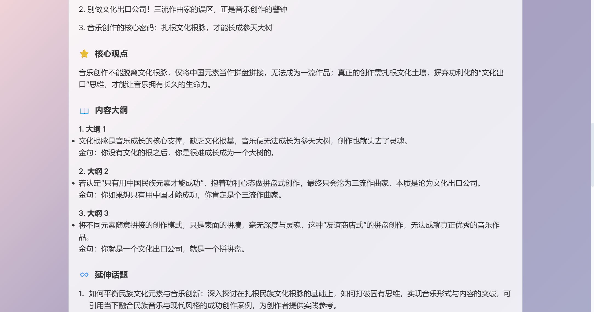

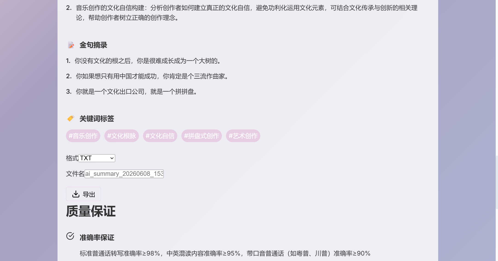

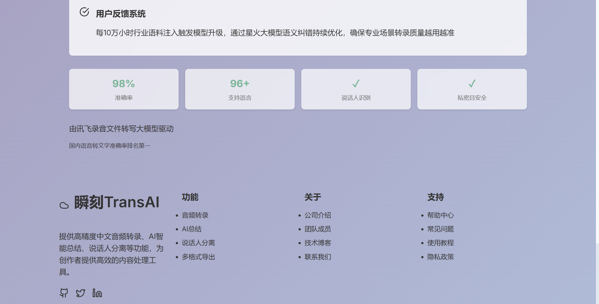

#### 多格式导出

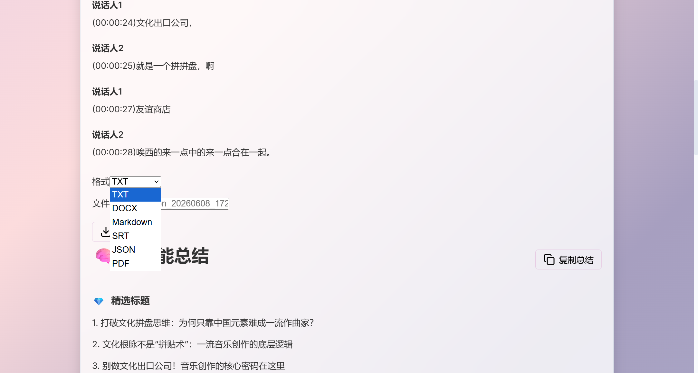

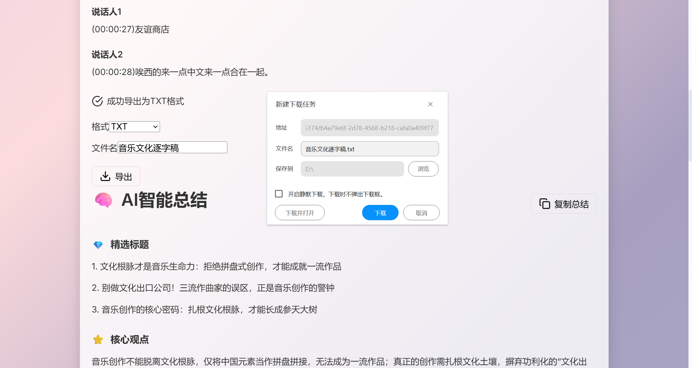

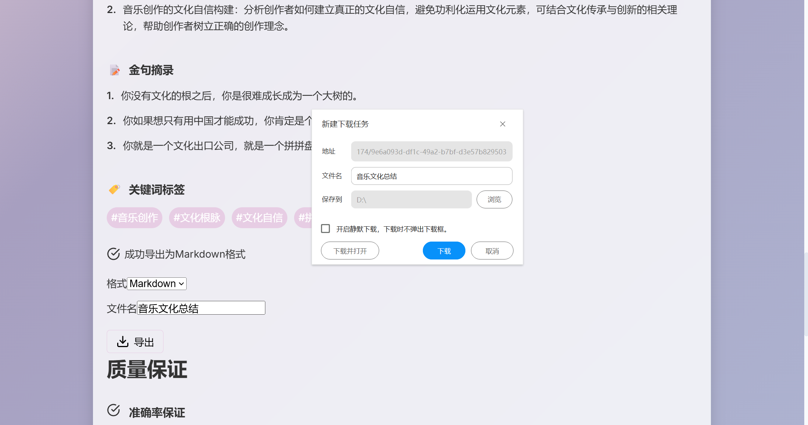

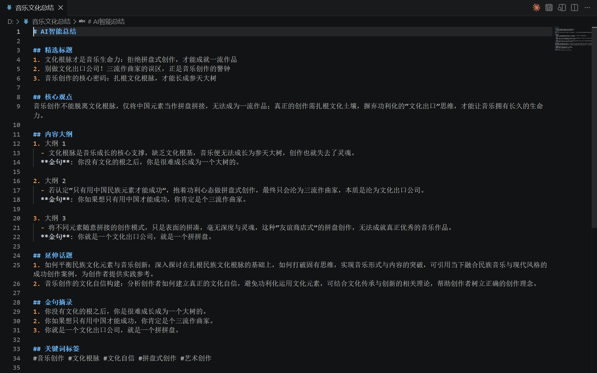

#### 个性化主题系统

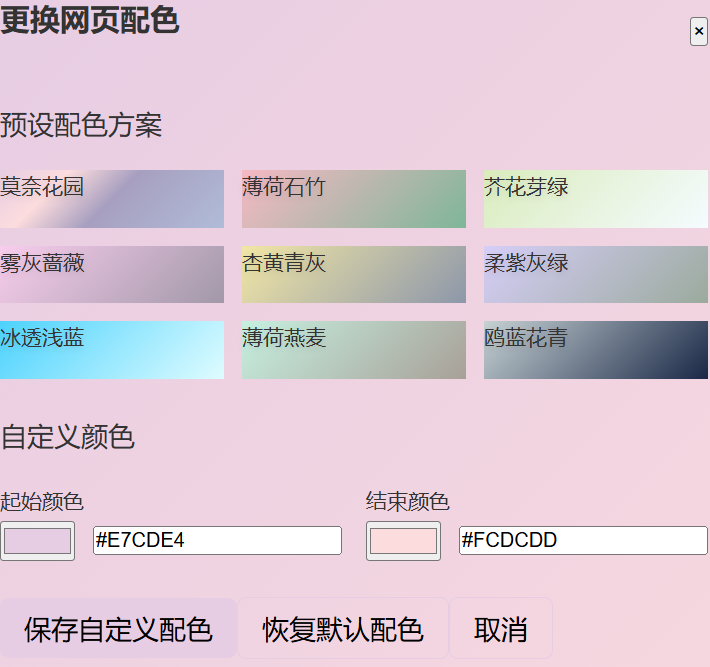

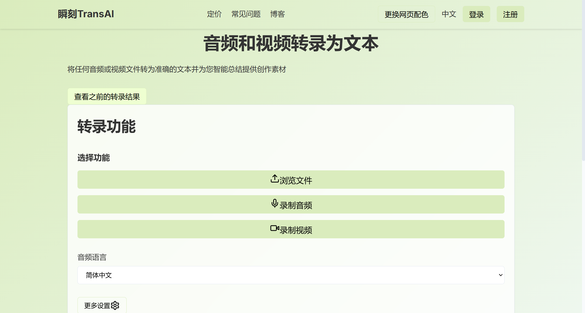

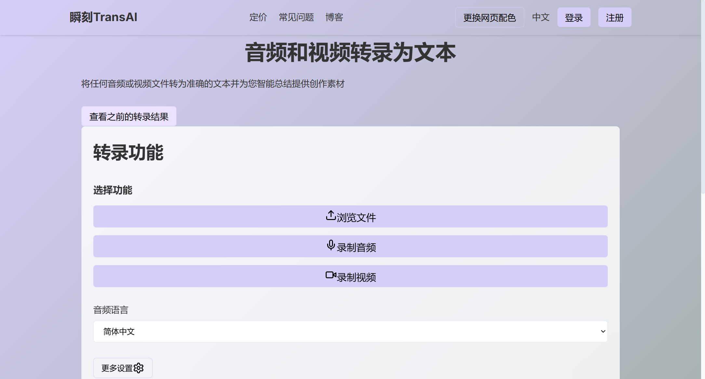

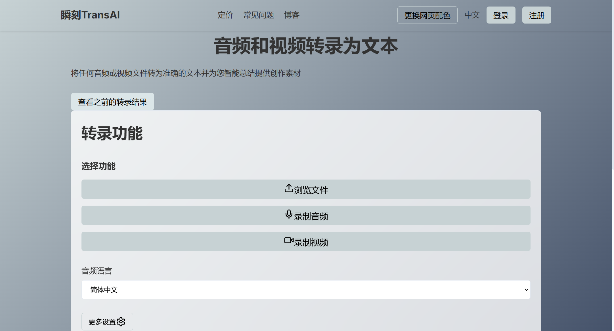

---

## 功能特点

### 1. 音视频录制与上传
- **描述**：支持麦克风录音、摄像头录像、本地文件拖拽/选择上传，录制过程中实时预览画面。
- **技术实现**：基于 `MediaRecorder` API 实现浏览器端录制；`FFmpeg` 后端实现 `WebM → WAV` 格式转换；`Multer` 中间件处理文件存储，内部录音与用户上传文件分目录管理。

### 2. 高精度语音转写
- **描述**：调用讯飞语音转写大模型，支持多说话人自动分离、中英文及 202 种方言识别。
- **技术实现**：后端通过 HMAC-SHA1 签名鉴权调用讯飞 `v2/upload` 和 `v2/getResult` 接口，采用**指数退避轮询**策略获取转写结果。

### 3. AI 智能总结
- **描述**：对转录文本进行结构化分析，自动生成精选标题、核心观点、三段式大纲、延伸话题、金句摘录、关键词标签。
- **技术实现**：对接讯飞星火 `4.0Ultra` 大模型，通过 **Prompt Engineering** 设计系统提示词，引导模型输出固定格式的结构化内容，前端正则解析后渲染展示。

### 4. 多格式导出
- **描述**：支持将转录结果和 AI 总结导出为 TXT、DOCX、Markdown、SRT、JSON、PDF 共 6 种格式。
- **技术实现**：采用**策略模式**统一导出接口，`jsPDF` 生成 PDF，`html2canvas` 渲染截图，支持自定义文件名和导出进度反馈。

### 5. 个性化主题系统
- **描述**：提供 8 套预设配色方案和自定义颜色输入，实时切换网页整体配色。
- **技术实现**：CSS 变量动态注入 + `LocalStorage` 持久化，Header、Footer、按钮、卡片等组件颜色响应式联动。

### 6. 返回查看历史结果
- **描述**：点击"返回上传"后可通过按钮一键回到之前的转录结果，避免重复上传。
- **技术实现**：通过 React 状态提升，在 `App.tsx` 中保存上一次的转录数据，`UploadPage` 组件根据 `hasPreviousResult` 条件渲染"查看之前的结果"按钮。

---

## 技术栈

### 前端

| 技术 | 版本 | 说明 |
|------|------|------|
| React | ^18.2.0 | UI 组件化框架 |
| TypeScript | ^5.2.2 | 类型安全的开发语言 |
| Vite | ^5.2.0 | 前端构建与开发服务器 |
| Tailwind CSS | ^3.4.1 | 原子化 CSS 样式框架 |
| Framer Motion | ^11.0.24 | 页面交互动画 |
| Lucide React | ^0.364.0 | 开源图标库 |
| jsPDF | ^4.2.0 | PDF 文件生成 |
| Axios | ^1.13.5 | HTTP 请求库 |

### 后端

| 技术 | 版本 | 说明 |
|------|------|------|
| Node.js | 20.x | 运行时环境 |
| Express | ^4.18.2 | Web 服务框架 |
| TypeScript | ^5.4.3 | 开发语言 |
| Multer | ^1.4.5 | 文件上传中间件 |
| CryptoJS | ^4.2.0 | API 签名生成 |
| dotenv | ^17.3.1 | 环境变量管理 |
| ts-node-dev | ^2.0.0 | 开发热重载 |
| FFmpeg | — | 音视频格式转换 |

### AI 模型

| 模型 | 服务 | 用途 |
|------|------|------|
| 讯飞录音文件转写大模型 | 讯飞语音识别 API | 音视频文件 → 文字转录，支持多说话人分离 |
| Spark 4.0Ultra | 讯飞星火 API | 转录文本 → 结构化创作框架（标题/观点/大纲/金句/标签） |

---

## 注意事项

### 文件大小限制
- 前端限制：500MB（上传前校验）
- 后端限制：`Multer` 无额外限制，但受服务器内存和 FFmpeg 处理能力影响
- 讯飞 API 单次上传上限为 500MB，超长音频可分段处理

### 安全措施
- API 密钥通过 `.env` 文件管理，已纳入 `.gitignore` 排除版本控制
- 代码中不包含任何硬编码的真实密钥，所有密钥从环境变量读取
- 提供 `.env.example` 模板供开发者参考
- 上传的音视频文件已通过 `.gitignore` 排除，不会提交到仓库

### 大文件处理建议
- 长音频（> 2 小时）可先使用 FFmpeg 分割为 30 分钟片段再逐个上传
- 视频文件可先提取音频轨再上传，减少传输和处理时间
- 确保服务器有足够的磁盘空间存放临时转换文件

---

## 安装与运行

### 环境要求

- **Node.js** >= 18.x（推荐 20.x）
- **npm** >= 9.x
- **FFmpeg**（用于音视频格式转换，可选但推荐安装）

### 克隆项目

```bash
git clone https://github.com/Sover0/audio-video-transcription-platform.git
cd audio-video-transcription-platform
```

### 安装依赖

```bash
# 安装前端依赖
npm install

# 安装后端依赖
cd backend
npm install
cd ..
```

### 配置环境变量

复制 `.env.example` 为 `.env` 并填入你的 API 密钥：

```bash
# Windows PowerShell
Copy-Item backend\.env.example backend\.env

# macOS / Linux
cp backend/.env.example backend/.env
```

编辑 `backend/.env`，替换以下占位符：

```bash
# 讯飞API配置（请替换为你的真实密钥）
IFLYTEK_APP_ID=your_app_id_here
IFLYTEK_API_KEY=your_api_key_here
IFLYTEK_API_SECRET=your_api_secret_here
IFLYTEK_UPLOAD_URL=https://office-api-ist-dx.iflyaisol.com/v2/upload
IFLYTEK_RESULT_URL=https://office-api-ist-dx.iflyaisol.com/v2/getResult

# 星火大模型API配置（请替换为你的真实密钥）
SPARK_API_KEY=your_spark_api_key_here
SPARK_API_URL=https://spark-api-open.xf-yun.com/v1/chat/completions
SPARK_MODEL=4.0Ultra
SPARK_TEMPERATURE=0.5
SPARK_TOP_K=4
SPARK_MAX_TOKENS=4096

# 服务端口
PORT=3001
```

### 获取 API Key

1. 注册[讯飞开放平台](https://www.xfyun.cn/)账号
2. 在控制台创建应用，开通**录音文件转写**服务
3. 获取 `APP_ID`、`API_KEY`、`API_SECRET`
4. 在控制台开通**星火认知大模型**服务，获取 `SPARK_API_KEY`
5. 将以上密钥填入 `backend/.env`

### 启动项目

```bash
# 启动后端服务（端口 3001）
cd backend
npm run dev

# 新开终端，启动前端开发服务器（端口 5174）
cd ..
npm run dev
```

### 访问地址

打开浏览器访问：**http://localhost:5174/**

> 前端开发服务器已配置代理，`/upload` 路径转发至讯飞 API 上传接口，`/result` 路径转发至讯飞 API 结果查询接口。

---

## 项目目录结构

```text
audio-video-transcription-platform/
├── .gitignore                          # Git 排除规则
├── index.html                          # Vite 入口 HTML
├── package.json                        # 前端依赖与脚本
├── vite.config.ts                      # Vite 配置（含代理规则）
├── tailwind.config.js                  # Tailwind CSS 配置
├── postcss.config.js                   # PostCSS 配置
├── tsconfig.json / tsconfig.node.json  # TypeScript 编译配置
├── ffmpeg.7z                           # FFmpeg 二进制工具包（可选）
├── test_api.html                       # API 联调测试工具
│
├── src/                                # 前端源码
│   ├── main.tsx                        # React 应用入口
│   ├── App.tsx                         # 根组件（路由/状态管理）
│   ├── index.css                       # 全局样式
│   ├── components/
│   │   ├── Header.tsx                  # 顶部导航栏（含配色切换按钮）
│   │   ├── Footer.tsx                  # 底部信息栏
│   │   └── ColorSelector.tsx           # 配色选择面板（8 套预设 + 自定义）
│   ├── pages/
│   │   ├── UploadPage.tsx              # 上传/录制页面（录音、录像、文件上传）
│   │   └── ResultPage.tsx              # 结果页面（转录展示、AI 总结、导出）
│   └── utils/
│       └── formatTime.ts               # 时间格式化工具函数
│
├── backend/                            # 后端服务
│   ├── .env                            # 环境变量（含 API 密钥，已排除）
│   ├── .env.example                    # 环境变量模板（占位符）
│   ├── .gitignore                      # 后端 Git 排除规则
│   ├── package.json                    # 后端依赖与脚本
│   ├── tsconfig.json                   # TypeScript 编译配置
│   ├── server.ts                       # Express 服务主文件（转录/总结/文件管理）
│   └── uploads/                        # 上传文件存储目录（已排除）
│       ├── audio/                      # 内部录音文件
│       ├── video/                      # 内部录像文件
│       └── user_uploads/               # 用户上传的文件
│
└── images/                             # 项目截图（README 引用）
    ├── screenshot-upload.png
    ├── screenshot-result.png
    ├── screenshot-export.png
    └── screenshot-theme.png
```

---

## API 接口

### 认证说明

本项目当前**未实现 JWT 用户认证系统**。前端直接通过 HTTP 调用后端接口，API 密钥仅在后端服务器端使用，不会暴露给前端。

> **未来计划**：后续版本将引入基于 JWT 的用户注册/登录系统，实现多用户隔离、历史记录持久化等服务端功能。届时本地存储的用户设置（如配色主题）将与云端存储同步。

### 接口清单

| 方法 | 路径 | 认证 | 说明 |
|------|------|------|------|
| GET | `/health` | 否 | 健康检查，返回 `{ status: "ok" }` |
| POST | `/api/convert` | 否 | 音视频格式转换（接收文件，返回 WAV） |
| POST | `/api/transcribe` | 否 | 上传文件并启动转录（调用讯飞 API） |
| GET | `/audio/*` | 否 | 访问录音文件静态资源 |
| GET | `/video/*` | 否 | 访问录像文件静态资源 |
| GET | `/user_uploads/*` | 否 | 访问用户上传文件静态资源 |
| GET | `/temp/*` | 否 | 访问临时转换文件 |

---

## 贡献指南

欢迎提交 Issue 和 Pull Request。提交 PR 前请确保代码通过 TypeScript 编译检查。

## 许可证

MIT License

## 作者

**瞬刻 TransAI** — [@Sover0](https://github.com/Sover0)